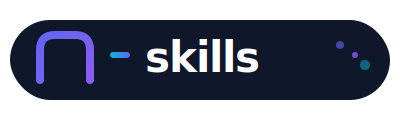

<div align="center">



<br/>
<br/>

**Curated by [Numman Ali](https://x.com/nummanali)**

[](https://x.com/nummanali)
[](LICENSE)
[](https://agentskills.io)
[](https://www.infoq.com/news/2025/08/agents-md/)

**One marketplace. Every agent.**

[Install](#-quick-start) · [Skills](#-available-skills) · [Submit a Skill](#-want-to-be-featured) · [Philosophy](#-philosophy)

</div>

---

## 💡 Philosophy

> **"Write once. Run everywhere."**

AI coding agents are evolving fast, and each has its own way of doing things:

```
Claude Code    →  CLAUDE.md, .claude/skills/
GitHub Copilot →  AGENTS.md, copilot-instructions.md
Codex          →  SKILL.md, ~/.codex/skills/
Cursor         →  .cursor/rules/*.mdc
Windsurf       →  Cascade Rules, Memories
Cline          →  .clinerules
Factory/Droid  →  .factory/droids/*.md
OpenCode       →  .opencode/skill/, opencode.json
```

### The n-skills Way

We embrace the diversity with a universal approach:

```
┌─────────────────────────────────────────────────────────┐
│                                                         │
│   SKILL.md          →  The universal skill format      │
│   AGENTS.md         →  The universal discovery file    │
│   openskills        →  The universal installer         │
│                                                         │
│   Write once. Run everywhere.                          │
│                                                         │
└─────────────────────────────────────────────────────────┘
```

[AGENTS.md](https://www.infoq.com/news/2025/08/agents-md/) is now adopted by **20,000+ repositories** and natively supported by GitHub Copilot, Google Gemini, OpenAI Codex, Factory Droid, Cursor, and more.

**n-skills is a curated marketplace.** Install via [openskills](https://github.com/numman-ali/openskills) or use your agent's native installer — your choice!

---

## 🚀 Quick Start

### Claude Code

```bash
/plugin marketplace add numman-ali/n-skills
```

Then install any skill:
```bash
/plugin install orchestration@n-skills
/plugin install open-source-maintainer@n-skills
/plugin install gastown@n-skills
/plugin install dev-browser@n-skills
/plugin install zai-cli@n-skills
```

### OpenSkills (Universal)

Works with **every agent**: Claude Code, Cursor, Windsurf, Cline, OpenCode, and anything that reads AGENTS.md.

```bash
npm i -g openskills
openskills install numman-ali/n-skills
openskills sync
```

> **New to OpenSkills?** It's the universal skills installer. [Learn more →](https://github.com/numman-ali/openskills)

<details>
<summary><strong>Other native installers</strong></summary>

**Codex:**
```bash
$skill-installer https://github.com/numman-ali/n-skills/tree/main/skills/tools/zai-cli
```

</details>

---

## 📦 Available Skills

| Skill | Category | Source | Description |
|:------|:---------|:-------|:------------|
| **[orchestration](./skills/workflow/orchestration/)** | `workflow` | native | Multi-agent orchestration with cc-mirror tasks + TodoWrite |
| **[open-source-maintainer](./skills/workflow/open-source-maintainer/)** | `workflow` | native | End-to-end GitHub repo maintenance for open-source projects |
| **[dev-browser](./skills/automation/dev-browser/)** | `automation` | [SawyerHood](https://github.com/SawyerHood/dev-browser) | Browser automation with persistent page state |
| **[gastown](./skills/tools/gastown/)** | `tools` | native | Multi-agent orchestrator (best with Claude Code + Opus) |
| **[zai-cli](./skills/tools/zai-cli/)** | `tools` | native | Z.AI vision, search, reader, and GitHub exploration via MCP |

> More skills coming soon. Want to contribute? See [CONTRIBUTING.md](CONTRIBUTING.md)

---

## 🗂️ Categories

| Category | What goes here |
|:---------|:---------------|
| `workflow` | Multi-agent orchestration, task coordination |
| `tools` | CLI tools and utilities |
| `development` | Language-specific dev assistance |
| `productivity` | Workflow automation |
| `automation` | Browser, CI/CD, system automation |
| `data` | Databases, data processing |
| `documentation` | Docs, diagrams, specs |

---

## 🎯 Want to be Featured?

This is a **curated** marketplace. Anyone can request to be included, but only **high-quality, real value-add projects** will be considered.

**What we're looking for:**
- Skills that solve real problems
- Clean, well-documented code
- Genuine utility for developers
- Active maintenance

**Not interested in:**
- Wrapper skills with no real value
- Abandoned or unmaintained projects
- Low-effort submissions

### How to Submit

1. Open an [issue](https://github.com/numman-ali/n-skills/issues) with your skill details
2. Explain what it does and why it's valuable
3. If approved, submit a PR following [CONTRIBUTING.md](CONTRIBUTING.md)

Or DM me on X: [@nummanali](https://x.com/nummanali)

---

## 🌐 Universal Compatibility

n-skills works everywhere because we use open standards:

| Agent | How it works | Status |
|:------|:-------------|:------:|
| **Claude Code** | Native plugin system | ✅ Native |
| **GitHub Copilot** | Reads AGENTS.md directly | ✅ Native |
| **Codex** | $skill-installer | ✅ Native |
| **Factory/Droid** | Reads AGENTS.md directly | ✅ Native |
| **Cursor** | openskills → AGENTS.md | ✅ Universal |
| **Windsurf** | openskills → AGENTS.md | ✅ Universal |
| **Cline** | openskills → AGENTS.md | ✅ Universal |
| **OpenCode** | Native skill support | ✅ Native |
| **Amp Code** | openskills → AGENTS.md | ✅ Universal |

---

## 🔄 Auto-Sync from Upstream

External skills stay in sync with their source repos automatically.

```
┌─────────────────────────────────────────────────────────────┐
│                                                             │
│   Your Repo              n-skills                           │
│   ────────              ────────                            │
│   skills/my-skill/  ──►  skills/category/my-skill/         │
│                                                             │
│   Daily cron syncs your latest changes.                    │
│   You maintain ownership. We curate the collection.        │
│                                                             │
└─────────────────────────────────────────────────────────────┘
```

**How it works:**
1. You maintain your skill in your own repo
2. Add an entry to [`sources.yaml`](sources.yaml) via PR
3. GitHub Actions syncs your skill folder daily
4. Attribution preserved via `.source.json`

**Why not submodules?** Submodule hell is real. This approach is simpler and works with openskills, Claude Code, and every other tool without special handling.

---

## 📁 Repository Structure

```
n-skills/
├── .claude-plugin/
│   └── marketplace.json       # Claude Code registry
├── .github/workflows/
│   └── sync-skills.yml        # Daily sync automation
├── scripts/
│   ├── sync-external.mjs      # Sync engine
│   └── update-registry.mjs    # Registry generator
├── sources.yaml               # External skill manifest
├── AGENTS.md                  # Universal discovery
├── skills/
│   ├── automation/
│   │   └── dev-browser/              # Synced from SawyerHood
│   │       ├── .claude-plugin/
│   │       └── skills/dev-browser/   # SKILL.md lives here
│   ├── tools/
│   │   ├── gastown/
│   │   │   ├── .claude-plugin/
│   │   │   └── skills/gastown/
│   │   └── zai-cli/
│   │       ├── .claude-plugin/
│   │       └── skills/zai-cli/
│   └── workflow/
│       ├── orchestration/
│       │   ├── .claude-plugin/
│       │   └── skills/orchestration/
│       └── open-source-maintainer/
│           ├── .claude-plugin/
│           └── skills/open-source-maintainer/
└── docs/
    ├── skill-format.md        # How to write skills
    ├── cross-platform.md      # Multi-agent compatibility
    └── categories.md          # Category guidelines
```

---

## 🔗 Related Projects

- **[openskills](https://github.com/numman-ali/openskills)** — Universal skills installer for all AI agents
- **[zai-cli](https://github.com/numman-ali/zai-cli)** — Z.AI capabilities via CLI and MCP
- **[agentskills.io](https://agentskills.io)** — The open standard for AI agent skills

---

<div align="center">

**Built for developers who value simplicity.**

Apache 2.0 · Made by [@numman-ali](https://github.com/numman-ali)

</div>
